"Github/Result_Plots" folder contains outputs for tasks 1-6.

Run "batchtest.m" to demonstrate tests 7-10 (uncomment out the task function as described at the top of the file). All necessary functions are contained in this file.

# Speaker Recognition Report
### Table of Contents  
- [1. Project summary](#1-project-summary)
  * [1.1 Data sets](11-data-sets)
  * [1.2 Key MATLAB functions](12-key-matlab-functions)
- [2. Feature extraction](#2-feature-extraction)
  * [2.1 Signal features](21-signal-features)
  * [2.2 Spectral decomposition](22-spectral-decomposition)
  * [2.3 Cepstral analysis](23-cepstral-analysis)
    - [2.3.1 Signal preconditioning](231-signal-preconditioning)
    - [2.3.2 Melody scale filtering](232-melody-scale-filtering)
    - [2.3.3 DCT](233-dct-of-the-logarithm-of-the-spectrum)
- [3. Feature matching](#3-feature-matching)
  * [3.1 Vector quantization](31-vector-quantization)
  * [3.2 Clustering and training](#32-clustering-and-training)
  * [3.3 Matching](33-matching)
  * [3.4 Notch filtering](34-notch-filtering)
- [4. Results](4-results)
  * [4.1 Initial results](41-initial-results)
  * [4.2 Optimization](42-optimization)
  * [4.2 Final results](43-final-results)

## 1. Project summary
This project builds a speaker recognition system using mel-frequency cepstrum coefficient (MFCC) feature extraction and a vector quantization (VQ) approach for feature matching. We study both speaker recognition and word recognition; both methods are inherently coded into the VQ feature matching approach. The overview of the process is as follows:
1. Train a set of codebooks by extracting MFCCs of training data (each codebook is trained by a single audio file) and quantizing the vectors into a reduced number of representative vectors.
2. For a given audio to be identified, find the mean distortion against each codebook in the set. The codebook with the lowest distortion identifies the speaker and word.

### 1.1 Data sets
The training and testing data count are the count of individual voices.
* Baseline test data of "zero"; 11 training, 8 testing
* 2024 student recordings of "zero" and "twelve"; 18 training, 18 testing
* 2025 student recordings of "five" and "eleven"; 23 training, 23 testing
### 1.2 Key MATLAB functions
* `out = mfccvec(file)`: Creates an MFCC matrix from a sound file. Inputs `file` as a text string, outputs matrix `out` with 12 coefficient rows and variable frames.
* `m = melfb_own(p, n, fs)`: Creates mel spaced filter banks. Inputs `p` number of filter banks, `n` number of FFT coefficients, and `fs` sampling frequency and outputs matrix `m` containing mel-filter banks.
* `codebook = vq(mfcc, M, eps)`: Creates a codebook from a training MFCC matrix. Inputs matrix `mfcc` of mel-frequency cepstrum coefficient vectors, `M` number of centroids, and `eps` splitting parameter and outputs M x n `codebook`, where n equals the cepstrum coefficient count.
* `vq_dist(test, codebook)`: Computes total distortion between test data and an existing codebook. Inputs matrices `test` and `codebook` and outputs total distortion `dist` of test vectors against codebook words.

## 2. Feature extraction
### 2.1 Signal features
Speech signals contain information. The human vocal tract consists of a series of mechanical and acoustic structures, the diaphragm, lungs, throat, vocal cords, mouth, tongue, and lips, all of which work in coordination to produce sound. These structures, as well as their modulation, vary from speaker to speaker: two individual speakers are differentiable to a listener even if the words spoken are identical.

The acoustic information of speech can be captured and analysed as digital recordings. This project seeks to recover and classify this contained information as a means to differentiate and identify a set of different speakers. We will do so by analysing the cepstrum, which is a structure that describes the distribution of harmonic information in a signal, which is useful as it provides an analytic means to describe the nature of each speakers’ unique vocalizations.

### 2.2 Spectral decomposition
Speech information is formed by the structures in the vocal tract, which are dynamic and resonant. The resulting acoustic signals thereby contain a series of tones and noises which vary in time. Fourier analysis on its own is then incomplete for this task, as the dynamic formation of speech in time is as important as the resonant harmonics at any point in time. We instead decompose the speech record in both frequency and time by use of the spectrogram.
	
The spectrogram is constructed by a series of Fourier transforms on a signal; an evenly time sampled record is divided into even segments, then the Fourier transform is taken on each segment. The resulting spectrogram on a one-dimensional signal is a two-dimensional structure, typically showing the positive Fourier coefficient magnitudes as color, indexed by frequency in the vertical direction, and time in the horizontal.

| 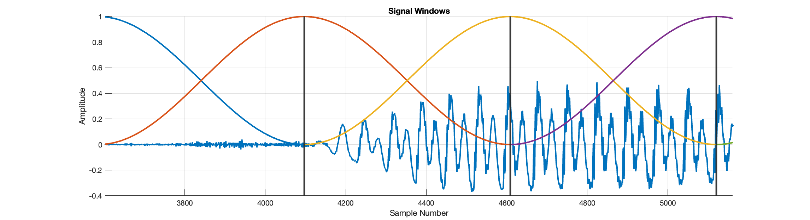 | 
|:--:| 
| *Figure 2.2.1. An example speech signal, blue, is cut into segments that are 1024 samples long, with an overlap of 512 samples. Hann windows are applied to each segment to minimize lobing in the resulting Fourier spectra.* |

Construction of the spectrogram is relatively straightforward; determine the desired frequency and time resolution required, ‘chop up’ the signal and perform any required preprocessing on the segments, then perform the FFT on each segment.

| 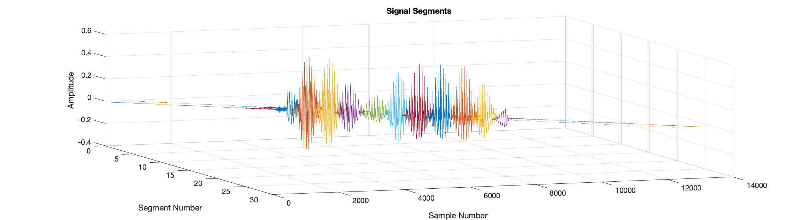 | 
|:--:| 
| *Figure 2.2.2. The resulting set of windowed signal segments that are used for each frame of the spectrogram.* |

| 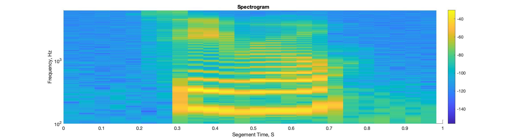 | 
|:--:| 
| *Figure 2.2.3. FFTs are taken on each segment to produce a spectrogram frame. The result is an image, which shows signal frequency information in the vertical axis as it changes over the duration of the record in the horizontal axis. Data here is shown on a logarithmic frequency scale between 100Hz and 6,250Hz to more clearly show the tones in the lower portion of the voice. Amplitude is shown in dB.* |

### 2.3 Cepstral analysis
A cepstrum is formed by taking the spectrum of a spectrum, and is used to analyse the structure of frequencies and their relationships in a signal. Any Fourier-like transform that maps a space using sinusoidal basis functions can be seen as quantifying the periodicity or repetition rate of features in the original signal. The transform describes how often features occur in the original base dimension; repetition per time (frequency), repetition per distance (images), or in the cepstrum’s case, repetition per repetition. This quantification of information about the signal makes our project a good candidate for cepstral analysis, as we seek to quantify vocal ‘fingerprints’ which describe the vocal differences of various speakers in a way we can use to identify them later.
The general computation is straightforward: take the logarithm of either an amplitude or power a spectrum and perform another transform. Several interim steps are used in order to better optimize the cepstrum for speech analysis.

#### 2.3.1 Signal preconditioning
A preconditioning filter is applied to the signal prior to generation of the spectrogram. Typically this is in the form of a single pole FIR highpass, which is used to emphasise high frequency content in the original signal.
| 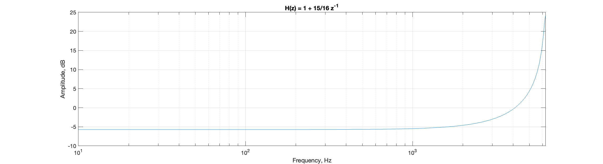 | 
|:--:| 
| *Figure 2.3.1. A single-pole FIR of the form H(z) = 1 + 15/16z-1, which shows general attenuation of the frequency response over most of the band, and large gain towards high frequency.* |

| 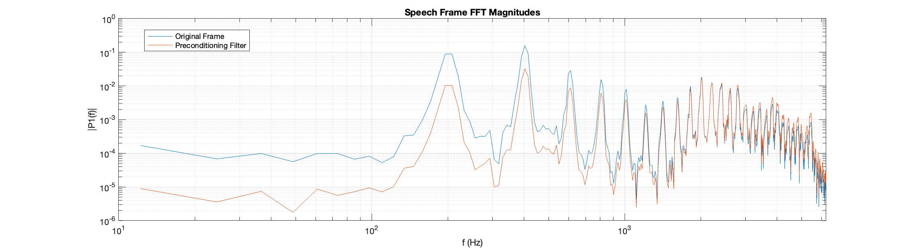 | 
|:--:| 
| *Figure 2.3.2. A single frame of a speech spectrogram shown on logarithmic scales, which shows the strong set of tones present during this portion of the original speech record (blue). The same frame after a preconditioning highpass filter is applied (red).* |

#### 2.3.2 Melody scale filtering
Human hearing has evolved in tandem with the human voice, and so structures that determine perception in the ear are well matched to the distribution of information over frequency in the human voice. The Mel-Scale is a commonly used tool to approximate the logarithmic scale at which humans decode sound. We capitalize on this as a way to ‘pre-emphasize’ the information in the spectrogram over frequency, resulting in a cepstrum analysis that more closely identifies features similar to the way a human ear does.
	
This is accomplished by filtering the spectrum frames into a set of logarithmically-spaced bands, and considering only the signal contained within each of the bands. The spectrogram data is reduced by this process which is non-reversible, however this is not detrimental to our analysis.

| 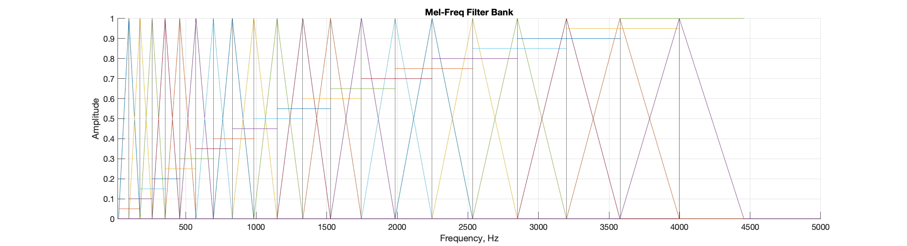 | 
|:--:| 
| *Figure 2.3.3. The Mel-Freq filter bank plotted over frequency. Each filter is roughly triangular in the limit of the original FFT frequency resolution. Here the ‘distribution of importance’ of each band is apparent, with lower frequencies being narrower and thus more sensitive to tonality.* |

| 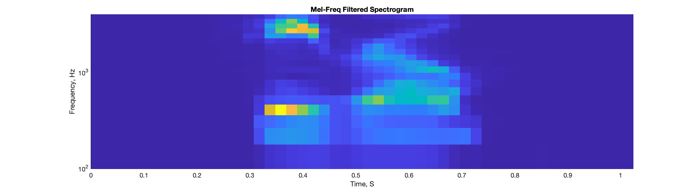 | 
|:--:| 
| *Figure 2.3.4. Application of the filter banks on the original spectrogram, showing the reduction of specific frequency resolution. The general speaker vocal features are maintained.* |

#### 2.3.3 DCT of the logarithm of the spectrum
The final step to produce the Mel-frequency cepstrum is to perform another transform on the resulting filtered spectrogram. The logarithm is taken on the spectrum coefficients, which is done as a means to reduce the contrast between large and small peaks. This compression step also roughly emulates the logarithmic amplitude response of the human ear.

| 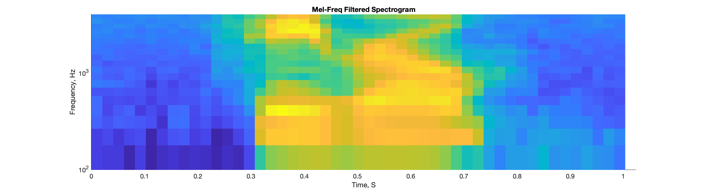 | 
|:--:| 
| *Figure 2.3.5. Logarithmic amplitude scaling of the filtered spectrogram, which shows much more voice information at an even level.* |

The Mel-frequency cepstrum is finally computed by taking the discrete cosine transform on the scaled, filtered spectrogram. Both the Fourier and inverse Fourier transforms can be used for this step. Commonly the inverse Fourier transform is used, and so results are interpreted as being in the time domain, which typically are in terms of time duration per feature. Both the Fourier transform and the discrete cosine transform, which are both ‘forward’ transforms, can be used, the resulting space is typically referred to as “quefrency”, or cepstral domain, which is in units 1/frequency.

| 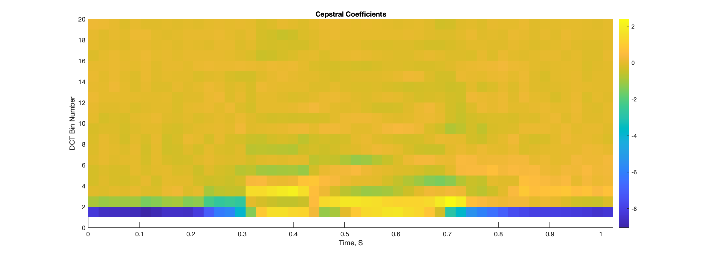 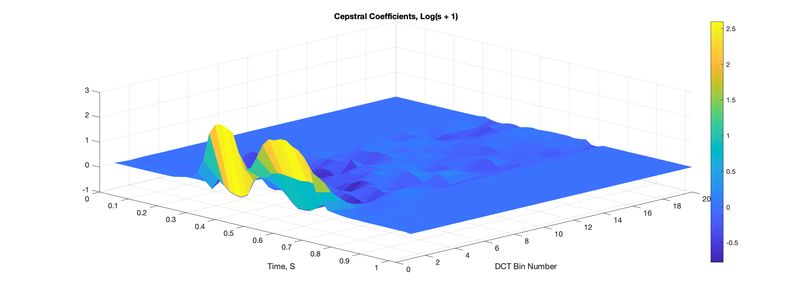| 
|:--:| 
| *Figure 2.3.6. The logarithmic DCT of the Mel-freq filtered spectrogram as-is, showing the compression of the primary features to the lower bins, which is a main characteristic of the DCT (top). The cepstrum of the logarithm of the spectrum plus 1 shows the general spectral content of the filtered spectrogram without the very large offset due to the log of spectrogram terms near 0 (bottom).* |

The resulting cepstrogram contains a qualitative measure of the original speaker’s vocal qualities for a specific phrase. This data can be compared through a number of means against other samples to measure speaker likeness and ultimately as a means for differentiating and estimating unknown speaker sources.

## 3. Feature matching

### 3.1 Vector Quantization
Theoretically, a speaker saying the same word or phrase twice would result in two identical cepstra. In practice however this isn’t the case. As a means of generalization of the cepstral information, we employ Vector Quantization (VQ). The cepstral data, which is a set of frames each containing coefficients for each quefrency (DCT bin), is considered a set of N DCT Bin dimension N Frames vectors. Typical analysis omits the first DCT bin and uses the following 12, such that the vector space is 12th dimensional and contains N Frames vectors. This vector population is reduced to a smaller number of vectors of the same dimensionality. This reduction, or quantization, increases the generalization capabilities of the differentiator by averaging the near variations of a speaker’s voice (many vectors near one another) to a single centroid point.

### 3.2 Clustering and Training

For feature matching, we adopt the Vector Quantization (VQ) method. Clustering is performed using the LBG algorithm with slight modifications for numerical stability. The algorithm is implemented as follows:

<table align="center"">
  <tr>
    <td bgcolor="gray"><b>Inputs:</b>
      <ul>
        <li><b>MFCC matrix</b> (<i>n</i> frames × <i>m</i> coefficients)</li>
        <li><b>M</b> (size of codebook)</li>
        <li><b>ε</b></li>
      </ul>
      <b>Output:</b>
      <ul>
        <li><b>Codebook</b> (<i>m</i> × <i>M</i>)</li>
      </ul>
    </td>
  </tr>
  <tr>
    <td><b>Algorithm:</b>
      <ol>
        <li>Initialize codebook (find mean of input MFCC vectors)</li>
        <li>While codebook size &lt; <i>M</i>:
          <ul>
            <li>Set <i>min_distortion</i> = ∞</li>
            <li>Split codebook
            </li>
            <li>While <b>true</b> until <b>break</b> condition:
              <ol>
                <li>Create empty vectors <i>cells</i> and <i>dists</i></li>
                <li>For <i>n</i> frames in MFCC matrix:
                  <ul>
                    <li>Compute the distance to each centroid</li>
                    <li>Select min distance</li>
                    <li>Store centroid number in <i>cells</i></li>
                    <li>Store corresponding distance (distortion) in <i>dists</i></li>
                  </ul>
                </li>
                <li>For <i>y</i> centroids in <i>codebook</i>:
                  <ul>
                    <li>Find <i>cells == y</i> and index corresponding MFCC vectors</li>
                    <li>Compute the new mean of these vectors and update <i>y</i></li>
                  </ul>
                </li>
                <li>Compute <i>new_distortion</i> by averaging <i>dists</i></li>
                <li>Compute change in distortion: <i>min_distortion</i> - <i>new_distortion</i>
                    If change in distortion is smaller than <i>threshold</i>, <b>break</b>
                    Else, update <i>min_distortion</i> with <i>new_distortion</i>
                </li>
              </ol>
            </li>
          </ul>
        </li>
      </ol>
    </td>
  </tr>
</table>

| 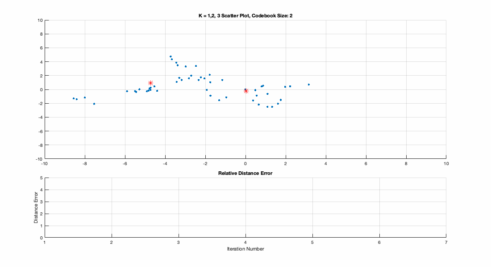 | 
|:--:| 
| *Figure 3.1. K-Means Vector Quantization algorithm steps, showing the scatter of vector points for the first two dimensions of the cepstrum (top, blue), as well as the centroids (top, red) and Voronoi regions for the centroids (top, orange). The mean distortion distances are shown for each iteration for each codebook bifurcation (bottom, black).* |

Selection of *ε* too small keeps the split centroids too close together, and the minimum distance from all vectors to the nearest centroid may be assigned only to a single centroid. Thus we employ one of two methods:

- Set empty centroid to zero: conceptually not optimal and doesn’t follow the LBG algorithm, since we now reorder the centroid list.  
- Set empty centroid to previous centroid.

We are fortunate that the recursive nature of the algorithm accounts for this and corrects the location of the centroids, even if we now use a greater number of cycles to perform this correction. We demonstrate with results that the codebooks formed with both methods return high accuracy. 

### 3.3 Matching

Once the codebooks have been completed, we tackle the problem of matching test sets against them. We considered a few methods for matching:

1. Generate a new codebook of clusters from the test vectors and compare the similarity between this codebook and the training codebooks.  
2. Use the raw MFCC vectors and compute the total distortion between the uncompressed data and the training codebooks.

We initially used method 1 but quickly noticed we could get good results with the other method. In addition, the order of complexity for one calculation of the codebook is $O(fM\text{log}(M))$, where *M* is the size of the codebook and $f$ is the number of MFCC frames. The complexity of the distance calculation for the distortion calculation function `vq_dist(test, cb)` is $O(nM)$, where $n$ is the size of the test codebook and $M$ is the size of the training codebook. This results in a total complexity of $O(fM\text{log}(M)\+nMc)$, where c is the number of codebooks.

Method 2 avoids the clustering step and decreases total complexity to $O(fMc)$. This change also more closely coincides with the theory behind VQ distortion - by finding the distance from each frame to the nearest codeword, we inherently cluster the test vectors by association. We then take the total sum of the distances to the codewords and compute the total distortion.

However, we demonstrate in our final results that quantizing the test vectors also end up with very accurate results, even if the computation takes more time.

### 3.4 Notch filtering
A modified test data set was produced by applying a series of narrow band reject filters to the test dataset records. Four filters were chosen with center frequencies of 200Hz, 450Hz, 1.2kHz, and 3700kHz, each with a bandwidth plus/minus 10Hz above and below each center frequency. The FIR order chosen was 256, and the filter was applied bidirectionally to maintain signal characteristics at the start and end of the signal to match the unfiltered signals as closely as possible.
The baseline test and training data initially produced an identification rate of 7 out of 8, with the one miss of s3 in the test data being attributed to the s6 training data sample. The filtered test data, when compared against the unaltered training data, also produced a 7 out of 8 accuracy with the same fault of s3 filtered test to s6 training.
When compared to the baseline 2024 student recording “twelve” training set, the test set of the same phrase yielded a 17 of 18 accuracy rate, with the miss being test data 1 being attributed to training data 18. After application of the filtering parameters previously defined, the success rate was still the same 17 of 18, however now the miss was then test data 18 was attributed to training data 12.
Application of notch filtering on static bands of the data going into the cepstrum processing stage likely has minimal effect on the overall ceptstral output. The cepstrum encodes the relationship of harmonics present in the speech record over frames of the record’s spectrogram. Removing frequency content via narrow band filtering effectively removes a handful of spectral bins, nullifying the ‘stripes’ that those bins represent in the spectrogram. The results of the generated cepstra with and without those frequency bands in the original spectra depends on the frequency distributions in the rest of the signal. If there are sufficient harmonics present in the rest of a series such that a single missing harmonic doesn’t sufficiently occlude the spectral distribution, then the resulting cepstral coefficients will still likely represent the original series’ harmonic content. 

## 4. Results
### 4.1 Initial results
Tests 1-6 are located in /Github/Result_Plots. Results for tests are discussed in this section. Initial results are shown in the table below.
| Test | Description | Result |
| :---- | :---- | :---- |
| 7 | Recognition rate of baseline “zero” recordings | 7/8 (87.5%) |
| 8 | Recognition rate after using notch filters | 7/8 (87.5%) |
| 9 | 2024 student “zero” recordings + baseline “zero” recordings | 16/18 (89%) |
| 10a.1 | Accuracy of 2024 student data; “twelve” results vs “zero” results | "twelve": 14/18 (78%) "zero" 16/18 (89%) |
| 10a.2 | Accuracy of 2024 student data; speaker recognition vs word recognition | Speaker: 30/36 (83%) word: 36/36 (100%)|
| 10b | 2025 student data speaker recognition using "five" vs using "eleven" and total recognition results | "five": 21/23 (91.3%) "eleven": 22/23 (95.6%) word classification 46/46 (100%) |

### 4.2 Optimization
With our initial tweaks to the accuracy of the VQ clustering, we saw improved results.
We saw improved codebook matching with increased codebook size. Accuracy in recognition increased with codebook size until the size is about 3/4 (CHECK) of the training MFCC matrix. Past that, no increase in accuracy was observed, and further increasing the codebook size saw only diminishing returns.

We also modified our vector quantization function to allow for codebook sizes that were not powers of 2. Since the LBG algorithm inherently doubles each iteration, we end up with a quickly increasing codebook. To accomodate for this, on our last iteration we trim down the codebook size by trimming off random codewords and rerunning the centroid positioning optimization to adjust them to the lowest distortion. This effectively produces a codebook with any size possible for M.

### 4.3 Final results
Our final results showed high accuracy.
| Test | Description | Result |
| :---- | :---- | :---- |
| 7 | Recognition rate of baseline “zero” recordings | 8/8 (100%) |
| 8 | Recognition rate after using notch filters | 8/8 (100%) |
| 9 | 2024 student “zero” recordings + baseline “zero” recordings | 16/18 (89%) |
| 10a.1 | Accuracy of 2024 student data; “twelve” results vs “zero” results | "twelve": 15/18 (83%) "zero" 16/18 (89%) |
| 10a.2 | Accuracy of 2024 student data; speaker recognition vs word recognition | Speaker: 31/36 (86.1%) word: 36/36 (100%)|
| 10b | 2025 student data speaker recognition using "five" vs using "eleven" and total recognition results | "five": 23/23 (100%) "eleven": 22/23 (95.6%) word classification 46/46 (100%) |

We were separately able to achieve high recognition on our lowest performing data with notch filtering and using VQ clustering on the test data.
| Test | Description | Result |
| :---- | :---- | :---- |
| 7 | Recognition rate of baseline “zero” recordings | 8/8 (100%) |
| 8 | Recognition rate after using notch filters | 8/8 (100%) |
| 10a.1 | Accuracy of 2024 student data; “twelve” results vs “zero” results | "twelve": 17/18 (94%)|
